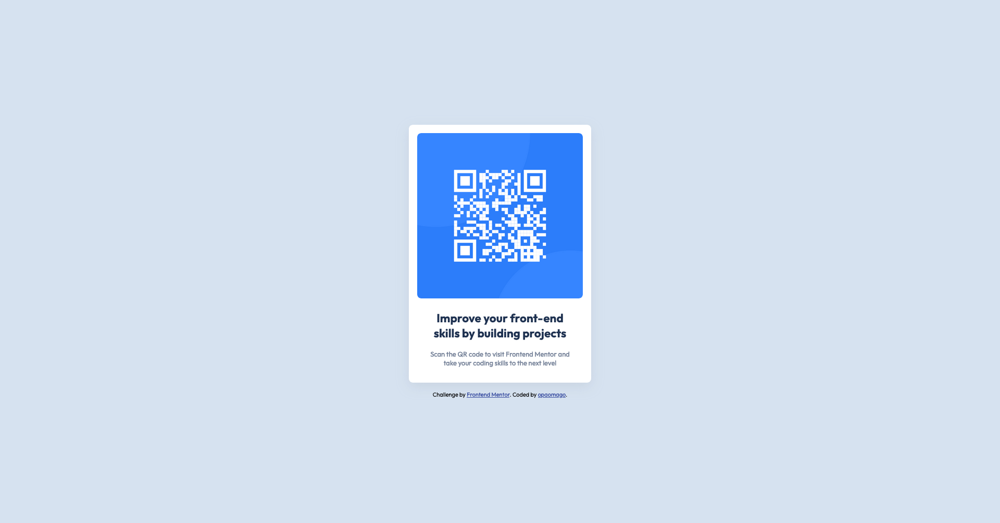

# Frontend Mentor - QR code component solution

This is a solution to the [QR code component challenge on Frontend Mentor](https://www.frontendmentor.io/challenges/qr-code-component-iux_sIO_H). Frontend Mentor challenges help you improve your coding skills by building realistic projects.

## Table of contents

- [Overview](#overview)
  - [Screenshot](#screenshot)
  - [Links](#links)
- [My process](#my-process)
  - [Built with](#built-with)
  - [What I learned](#what-i-learned)
  - [Continued development](#continued-development)
  - [Useful resources](#useful-resources)
- [Author](#author)

## Overview

### Screenshot



### Links

- Solution URL: [Add solution URL here](https://your-solution-url.com)
- Live Site URL: [Add live site URL here](https://your-live-site-url.com)

## My process

### Built with

- Semantic HTML5 markup
- CSS custom properties
- Flexbox
- Mobile-first workflow
- BEM methodology

### What I learned

I never really got the use of max-width property but using it here made it very
easy and accessible.

```css
.card {
  ...
  max-width: 350px;
}
```

### Continued development

Still very confused on wether using fixed widths is bad or not. Also not sure how
to work with images, they are always super large!

### Useful resources

- [BEM Methodology](https://en.bem.info/methodology/) - This helped me for organizing CSS. I really liked this pattern and will use it going forward.

## Author

- Frontend Mentor - [@opaomago](https://www.frontendmentor.io/profile/opaomago)
